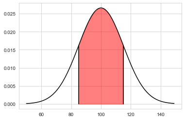

# Distribuição normal

A distribuição de probabilidade da variável normal depende de dois parâmetros, a média e desvio padrão, μ e σ, respectivamente.

$$f(x) = \frac{1}{(\sigma\sqrt{2 \pi})} e^{-(\frac{(x - \mu)^2}{2 \sigma^2})} $$


```python
# Importar as bibliotecas importantes
import scipy
from scipy.stats import norm                          # distribuição normal
import numpy as np                                    # gerar um intervalo
import matplotlib.pyplot as plt                       # plotar o gráfico
#import seaborn as sb                                  # configuração do gráfico
```

## Funções auxiliares
A seguir são declaradas funções que calculam o intervalo, a probabilidade acumulada, e a densidade. Para isso, foram usadas as bibliotecas matemáticas numpy e scipy (importadas na célula anterior).


```python
def gerar_intervalo(inicio, final, passo):
    """
    Essa função usa a função arange do numpy para gerar um intervalo
    """
    return np.arange(inicio, final, passo)
```


```python
def densidade_probabilidade(dados, media, desvio_padrao):
    """
    Essa função retorna a função densidade de probabilidade
    """
    return norm.pdf(dados , loc = media , scale = desvio_padrao)
```


```python
def probabilidade_acumulada(media, desvio_padrao, ponto):
    """
    Essa função retorna a probabilidade acumulada
    """
    return norm(loc = media , scale = desvio_padrao).cdf(ponto)
```

## Valores do problema apresentado
A seguir são utilizados os valores que estão descritos nesse problema

"Digamos que o número de caixa de remédios cardíacos de
farmácia popular é geralmente distribuído por uma distribuição
normal com média de 100 caixas por dia e desvio-padrão de
15 caixas. A proporção de caixas por dia fundamental para a
continuidade do funcionamento da farmácia popular está no
intervalo entre 80 e 120. Qual é a proporção esperada de
caixas por dia que possuem intervalo entre 80 e 120?"


```python
# declarando os valores
media = 100
desvio_padrao = 15

limite_inferior = 80
limite_superior = 120


```


```python
# densidade de probabilidade
dados = gerar_intervalo(inicio_grafico, final_grafico, 1)
pdf = densidade_probabilidade(dados, media, desvio_padrao)

# calcular probabilidade acumulada
prob_superior = probabilidade_acumulada(media, desvio_padrao, limite_superior)
prob_inferior = probabilidade_acumulada(media, desvio_padrao, limite_inferior)
```

## Calculando o intervalo
O problema pergunta "Qual é a proporção esperada de caixas por dia que possuem intervalo entre 80 e 120?". 
Para isso precisamos calcular a probabilidade do início e fim do intervalo e calcular a diferença.


```python
print(prob_superior)
print(prob_inferior)
```

    0.9087887802741321
    0.09121121972586788


```python
probabilidade_intervalo = prob_superior - prob_inferior
print(probabilidade_intervalo)
```

    0.8175775605482642


```python
pt1 = media + desvio_padrao
plt.plot([pt1 ,pt1 ],[0.0,scipy.stats.norm.pdf(pt1 , media, desvio_padrao)], color='black')

pt2 = media - desvio_padrao
plt.plot([pt2 ,pt2 ],[0.0,scipy.stats.norm.pdf(pt2 , media, desvio_padrao)], color='black')

ptx = np.linspace(pt1, pt2, 10)
pty = scipy.stats.norm.pdf(ptx,media, desvio_padrao)

plt.plot(dados, pdf , color = 'black')
plt.fill_between(ptx, pty, color='red', alpha=0.5)
```


    <matplotlib.collections.PolyCollection at 0x1334b8940>


    

    


## Resposta do problema

A proporção esperada de caixas por dia no intervalo apresentado (80, 120) é de 81.76% aproximadamente. O intervalo está apresentado no gráfico acima
